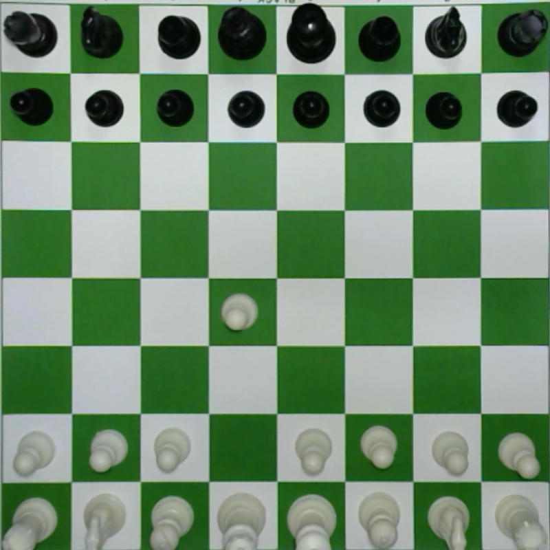
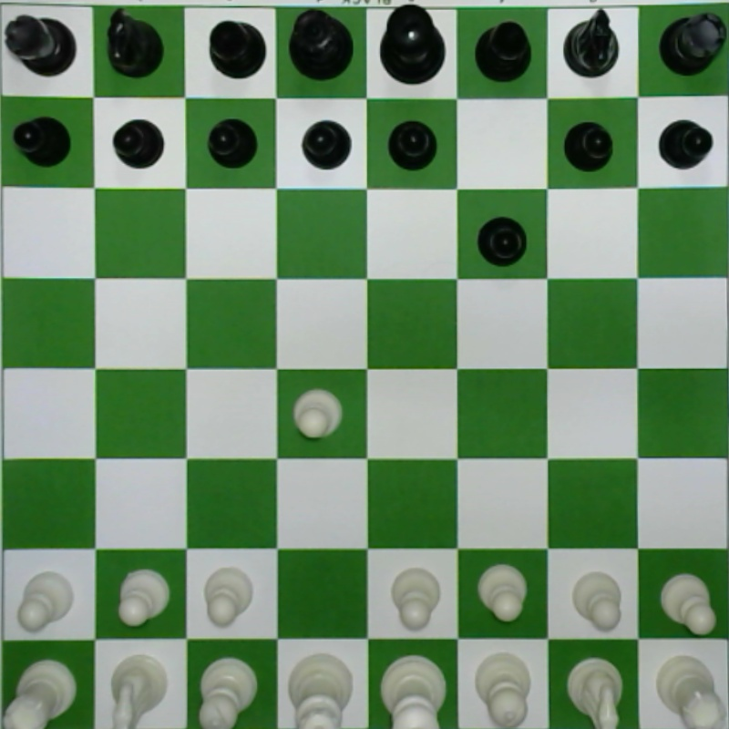
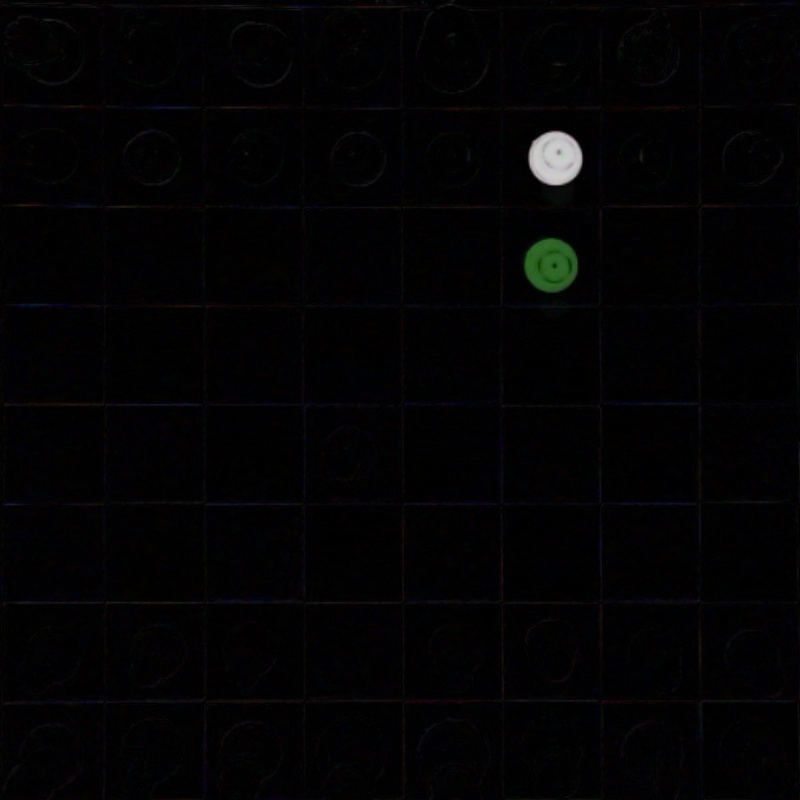
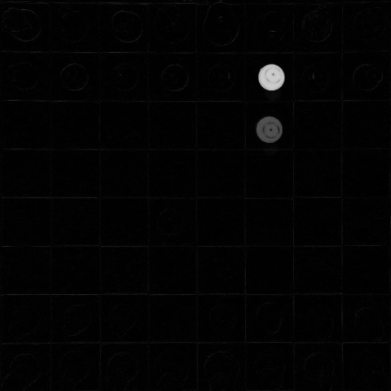

# opencv-chess
Human vs AI (Stockfish engine)

Camera captures the image of chessboard then the imageis analyzed using imageprocessing to identify the moves made by opponent and stockfish engine calculates the best possible move.

 |
:-------------------------:|:-------------------------:

# Youtube Video
|
:-------------------------:|:-------------------------:

# Method of Working
## Step - 1
Image1 : Image of Chess Board befor player move piece|Image2 : Image of Chess Board after player move piece
:-------------------------:|:-------------------------:
|

## step - 2
Difference of image by using function absdiff in CV2|Change Difference_image to Gray scale image
:-------------------------:|:-------------------------:
 diff = cv2.absdiff(image1,image2)|diff_gray = cv2.cvtColor(diff,cv2.COLOR_BGR2GRAY)|
 |

## Author

<table>
<tr>
<td>
     
     
     Vatsal Parsaniya

</td>
</tr> 
  </table>
